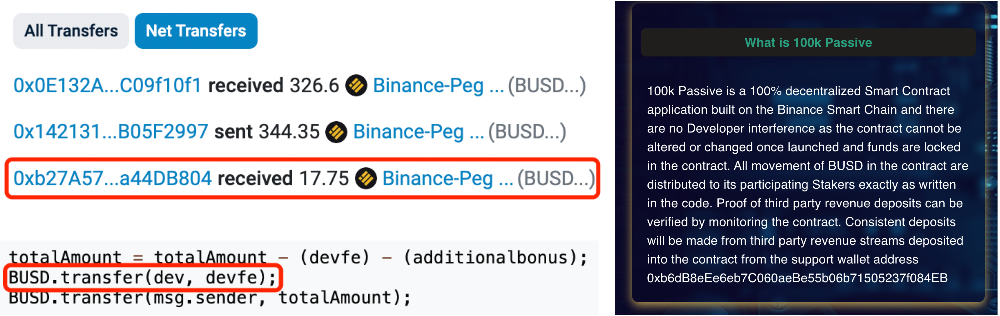

### experiment_result

This directory contains the raw experimental output of our evaluation section. Details about folders:

- `dataset`: csv data that records (DApp's name, DApp contract address, blockchain platform), including ground truth and wild datasets.

- `ground_truth`: the running output on ground truth dataset.

  - `backend`: the running output of contract bytecode analysis.

  - `frontend`: the running output of description analysis.

  - `evaluation_gt`: the inconsistency detection results of each DApp.

  - `exp_category_gt`: the catogrized detection result according to the inconsistency type. For the clarity, we do not use the name shown in the paper. The mapping relationship is shown below:

    ```csv
    clear => Unclaimed Fund Flow
    fee => Hidden Fee
    lock => Adjustable Liquidity
    metadata => Volatile NFT Accessibility
    pause => Changeable DApp Status
    reward => Unguaranteed Reward
    supply => Unconstrained Token Supply
    ```

- `wild`: the running output on wild dataset

  - `backend`: the running output of contract bytecode analysis on wild DApps.

  - `frontend`: the running output of description analysis on wild DApps.

  - `evaluation_wild`: the inconsistency detection results of each wild DApp.

  - `exp_category_wild`: the catogrized wild detection result according to the inconsistency type.
  
  - `sampling_exp`: sampling experiment based on the interval 10 and a confidence of 95%.
    - We use `00_FP` in each directory to outline the false positives we find during evaluation on the random sampled results.

### FN and FP analysis details

Our paper only highlights some critical information of our analysis on the FNs and FPs due to the page limit. We now use this repo to illutrate the details of them.

#### Missed by HyperText

Ground Truth: BNB Pirates, TrueFund, Staker Cafe, Cromatoes Greenhouse Ponzi, FinToCh BNB

Mentioned Alchemix case:

```text
... we are basing the numbers below on the total expected supply after 3 years. ...
```

HyperText is misled by key words `total` and `supply`.

#### Missed by HyperCode

Ground Truth: BUSD miner, CROBeansMiner, Miracle BUSD Gems ROI Miner, Staker Cafe, Libera Financial, Metarevo, Miracle BUSD Gems ROI Miner

> a case caused by missing pointer: Matrix Pro
>
> user can not be identified to flow to referral as the data flow into data structure userList and flow out, missing pointer
>
> ```solidity
> function payReferral(uint _level, address _user) internal {
>         address referer;
>        
>         referer = userList[users[_user].referrerID];
>        
>        
>          bool sent = false;
>        
>             uint level_price_local=0;
>             if(_level>4){
>             level_price_local=unlimited_level_price;
>             }
>             else{
>             level_price_local=LEVEL_PRICE[_level];
>             }
>             sent = address(uint160(referer)).send(level_price_local);
> ```

#### Wrongly reported by HyperCode

**Unconstrained Token Supply**

> 8lien's totalSupply() function
>
> ```solidity
> /**
>      * @dev Returns the total number of tokens in existence.
>      * Burned tokens will reduce the count.
>      * To get the total number of tokens minted, please see {_totalMinted}.
>      */
>     function totalSupply() public view virtual override returns (uint256) {
>         // Counter underflow is impossible as _burnCounter cannot be incremented
>         // more than `_currentIndex - _startTokenId()` times.
>         unchecked {
>             return _currentIndex - _burnCounter - _startTokenId();
>         }
>     }
> ```
>
> The totalSupply() is not to directly return a state variable

> MCHCoin's _mint function
>
> ```solidity
> function _mint(address account, uint amount) internal virtual {
>         require(account != address(0), "ERC20: mint to the zero address");
> 
>         _beforeTokenTransfer(address(0), account, amount);
> 
>         uint96 _amount = Uint96.cast(amount);
>         _totalSupply = _totalSupply.add(_amount);
>         require(_totalSupply <= _cap, "ERC20Capped: cap exceeded");
>         _balances[account] = _balances[account].add(_amount);
>         emit Transfer(address(0), account, _amount);
>     }
> ```
>
> The require check is after totalSupply update

**Hidden Fee**

> Huxley Comics's payment()
>
> ```solidity
> /// @dev Split value paid for a token
>     function payment() internal {
>         unchecked {
>             uint256 amount = (msg.value * 85) / 100;
>             (bool success, ) = trustedWallet_A.call{value: amount}("");
>             require(success, "HT56: Transfer A failed");
> 
>             amount = msg.value - amount;
>             (success, ) = trustedWallet_B.call{value: amount}("");
>             require(success, "HT56: Transfer B failed");
>         }
>     }
> ```
>
> The value is split to transfer to two wallets

**Unclaimed Fund Flow**

> Creature World NFT's withdrawAll()
>
> ```solidity
>     function withdrawAll() public payable onlyOwner {
>         uint256 _danny = address(this).balance * 39/100;
>         uint256 _kevy = address(this).balance * 25/100;
>         uint256 _jake = address(this).balance * 18/100;
>         uint256 _jacob = address(this).balance * 18/100;
>         require(payable(t1).send(_danny));
>         require(payable(t2).send(_kevy));
>         require(payable(t3).send(_jake));
>         require(payable(t4).send(_jacob));
>     }
> ```
>
> The balance are distributed to different accounts

**Unguaranteed Reward**

> Crotama's clearStuckBalance()
>
> ```solidity
>     function clearStuckBalance(uint256 amountPercentage) external authorized {
>         uint256 amountETH = address(this).balance;
>         payable(msg.sender).transfer(amountETH * amountPercentage / 100);
>     }
> 
> ```
>
> The funds are rescued by transferring to msg.sender

More Details are shown in our sampling exp `00_FP` folder.

### Case study



DApp <u>*100k Passive*</u> with *Hidden Fee Inconsistency* reported by Hyperion.

The DApp description (right of the figure) shows no information on how much fee will be charged by the contract. However, a development fee (5%) was transferred to a preset account `dev`, and the total amount of the user was subtracted by this fee without being informed.

The transaction log on invoking the *withdraw()* method on the left top of the figure shows that a user finally reaches the total amount of 344.35 BUSD but 5% development fee (17.75 BUSD) was charged by the development fee recipient address (0x142131).

Furthermore, the DApp also set another fee, i.e., project fee 27% but did not mention it in the DApp description while using it in the *invest()* function.
